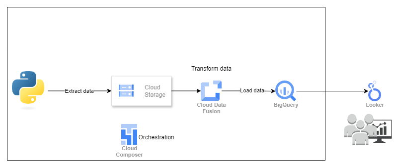
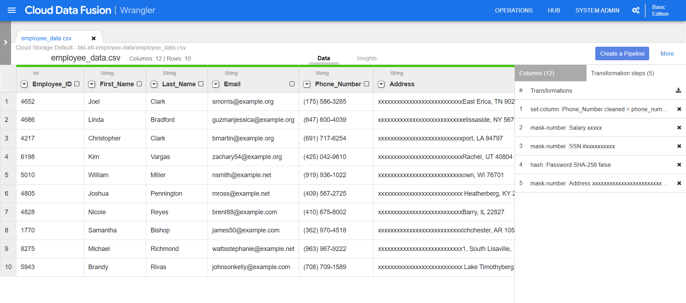
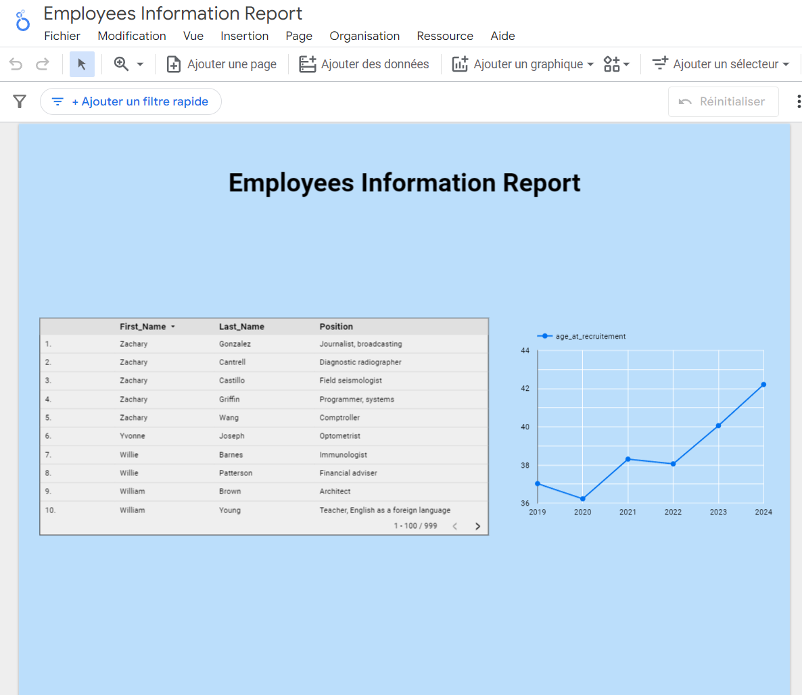
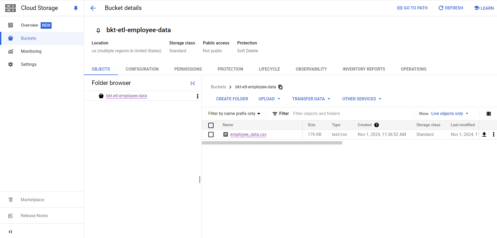
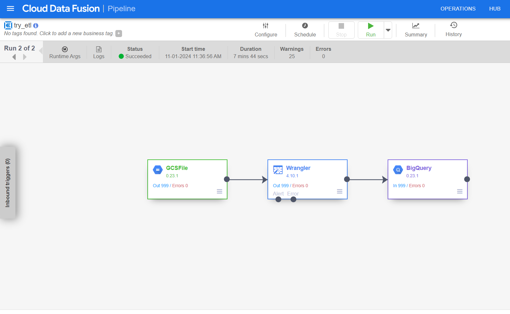
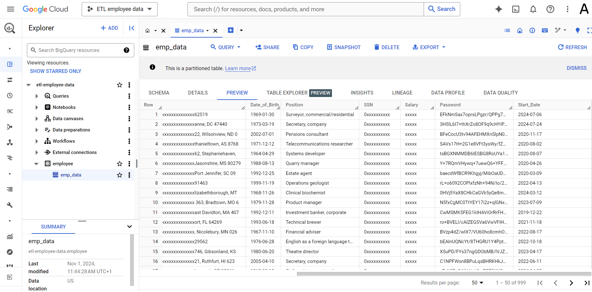
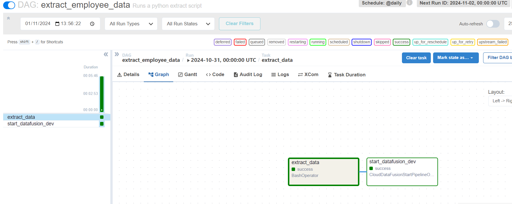
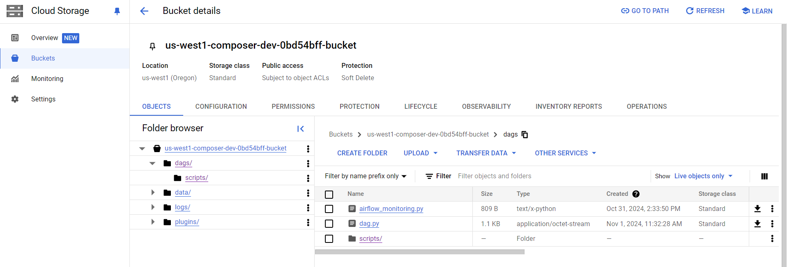

# Employee Data Pipeline and Dashboard | Modern Data Engineering GCP Project

## Introduction
This project focuses on building a secure data pipeline to process employee data by extracting it from csv file, masking sensitive information, and loading it into Google BigQuery. The final stage involves developing a web-based dashboard to visualize the data securely, and using new calculated fields, to provide actionable insights without exposing sensitive details. This project demonstrates secure data engineering practices on Google Cloud Platform (GCP) and data visualization techniques.

We will use Cloud Composer for orchestration, Cloud Storage for data storage, Cloud Data Fusion for data transformation, BigQuery as the data warehouse, and Looker for data visualization.

## Analysing the business requirements
The Employee Data Pipeline and Dashboard will provide:
1. **Data Extraction** – Collect employee data from a CSV file.
2. **Data Masking** – Identify and mask sensitive employee data such as social security numbers, salary information, passwords and phone numbers.
3. **Data Loading** – Load the masked employee data securely into Google BigQuery for further processing and analysis.
4. **Dashboard Visualization** – Develop a secure, web-based dashboard to visualize the employee data using Looker. The dashboard will provide insights while ensuring sensitive information remains protected.

## Architecture

## Technology Used
1. **Programming Language** - Python for creating dummy employee and for describing airflow pipeline
3. **Google Cloud Platform**
   - BigQuery for storing masked employee data
   - Cloud Storage for storing raw data
   - Looker for building the employee data dashboard
   - Cloud Composer as a managed apache airflow service used for orchestrating ETL processes
   - Cloud Data Fusion for data transformation and data pipeline creation

## Dataset Used
### Sample Employee Data
This dataset containing fields like employee ID, social security number, salary, job title and email. Masking will be applied to fields containing sensitive information to ensure privacy and compliance.

**Data Source**:
Sample company employee data will be generated using Faker python package and saved to a csv file.

## Scripts for Project
1. [Extract Script](extract.py) - generates data and uploads the output csv file to google cloud storage bucket.
2. [dag](dag.py) - automates the different ETL pipeline steps.

## Implementation Steps

### 0. Setup 
   - **Description**: 
   1. Create a Google Cloud Storage Bucket for extracted data and a Bigquery dataset and table as a sink for transformed data.
   2. Create DataFusion and Cloud Composer instances. 

### 1. Extract Data
   - **Description**: Generate fake employees data and save it to a CSV files (a sample is available in [employee_data.csv](employee_data.py) ).
   
### 2. Store Data in Cloud Storage
   - **Description**: Upload the raw extracted data to Cloud Storage for centralized storage and further processing.

### 3. Data Transformation in Cloud Data Fusion
   - **Description**: 
   1. Use Cloud Data Fusion Wrangler to transform and mask sensitive information in the data. This includes identifying and masking fields like social security numbers and salaries, hashing password field and standardizing phone numbers to a uniform format.
   - **Screenshot**: 
   2. Load transformed data into BigQuery: add BigQuery as a data sink when building the pipeline and configure it with project id, BigQuery dataset id, and target table name.
   3. Deploy the pipeline and run it.
      
### 4. Build the Dashboard in Looker
   - **Description**: Create a web-based dashboard in Looker to visualize the employee data securely. The dashboard includes metrics that provide insights while ensuring sensitive data remains masked.
   - **Screenshot**: 

### 6. Orchestration with Cloud Composer
   - **Description**: Set up Cloud Composer to orchestrate the entire ETL workflow, from extraction to dashboard updates.
   1. create a scripts folder in the composer's instance dags folder and upload the extraction python script.
   2. create an airflow dag script to automate the extraction of data and ETL DataFusion pipeline.
   3. upload dag to the dag's folder.
   
## Screenshots of Implementation Steps
Below are screenshots showing the key steps in implementing the Employee Data Pipeline and Dashboard:

1. **Data Extraction** - 
2. **DataFusion pipeline** - 
3. **Data Loading** - 
4. **Dashboard Visualization** - 
5. **Orchestration** -   
